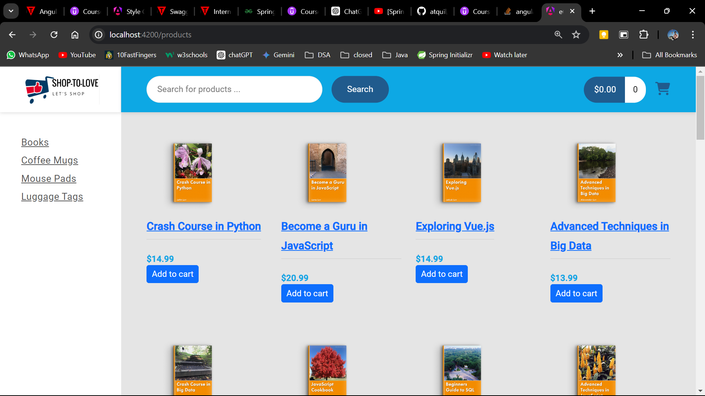
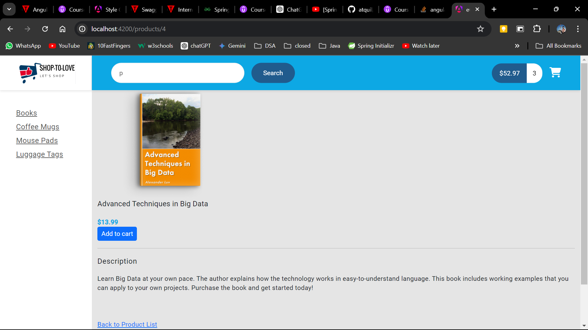
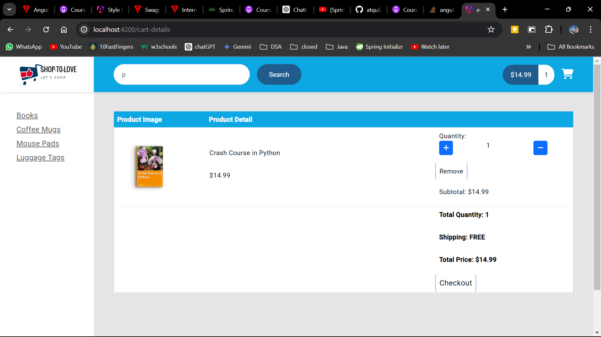
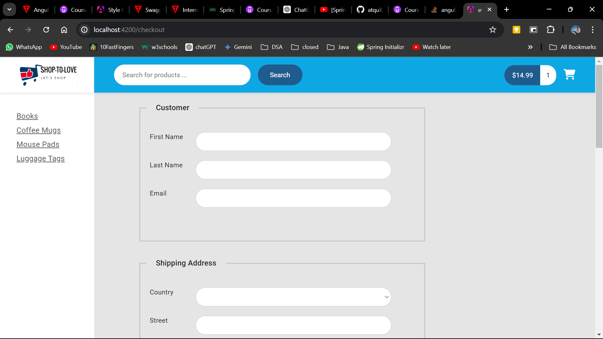
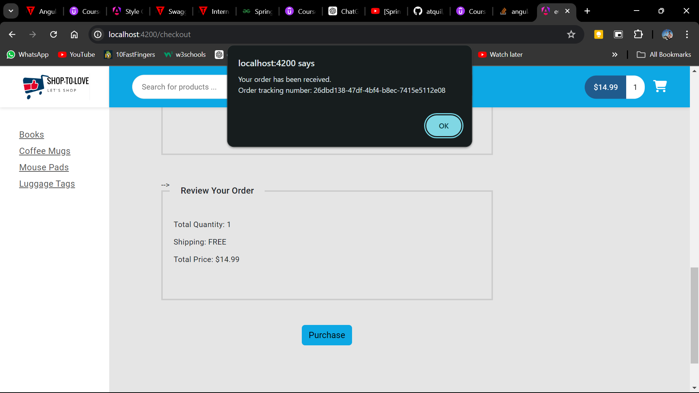
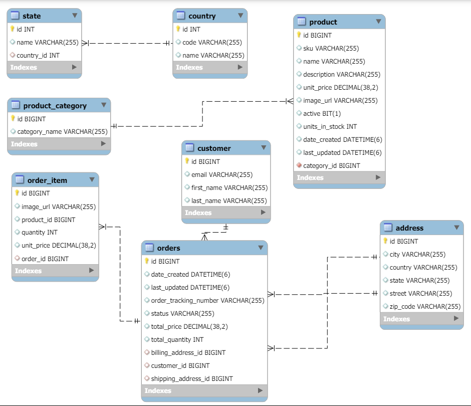
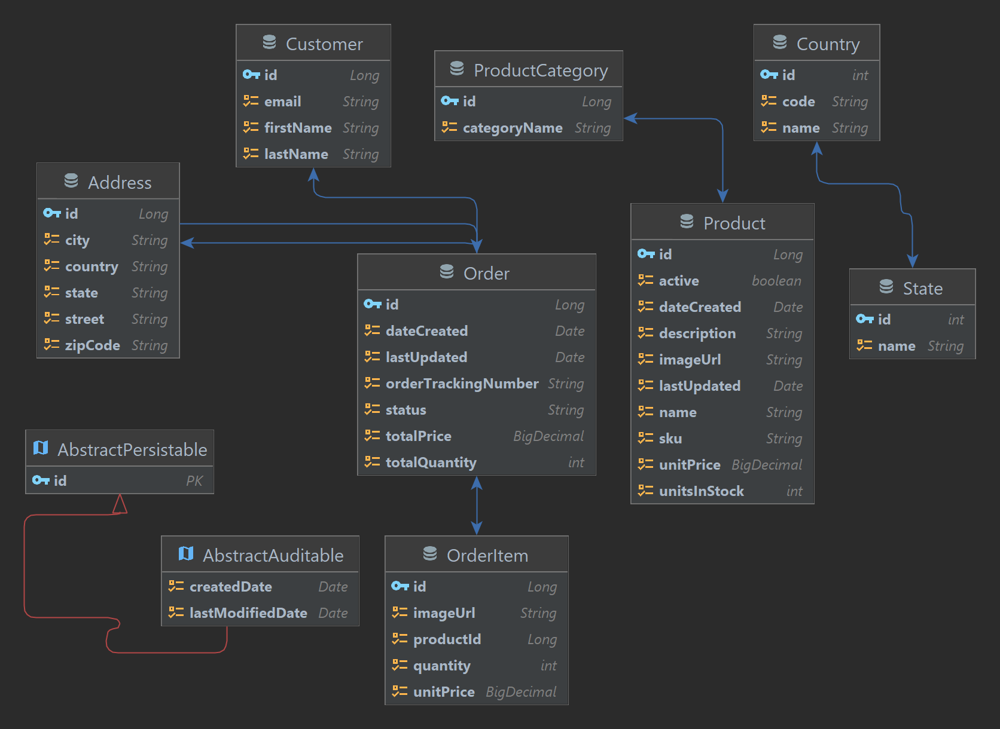

# E-commerce Website

- Enjoy live experience: 
- Consume Restful webservices :
 https://ecommerce-rmhk.onrender.com/api


Welcome to the E-commerce Website repository! This project is a full-stack web application built with Spring Boot and Angular. It provides a seamless shopping experience with secure user authentication, product management, and order processing functionalities.

## Table of Contents

1. [Project Overview](#project-overview)
2. [Tech Stack](#tech-stack)
3. [Features](#features)
4. [Screenshots](#screenshots)
5. [ER Diagram](#er-diagram)
6. [Getting Started](#getting-started)
7. [Project Structure](#project-structure)
8. [Contributing](#contributing)
9. [License](#license)

## Project Overview

This E-commerce website allows users to browse products, add them to a shopping cart, and securely complete purchases. The application features user authentication and authorization using Okta, product management for administrators, and integrates with Stripe for payment processing. Additionally, the application is secured with SSL for safe transactions.

## Tech Stack

### Backend:
- **Spring Boot**
- **Spring Data JPA**
- **Hibernate**
- **Spring Security**
- **MySQL**
- **Stripe**

### Frontend:
- **Angular**
- **Angular Router**
- **Angular Forms**
- **Angular Material**

### Authentication:
- **Okta**

### Security:
- **SSL (HTTPS)**

## Features

- **User Authentication**: Secure login and registration using Okta.
- **Product Management**: Admin interface for adding, updating, and deleting products.
- **Shopping Cart**: Add to cart, update quantities, and remove items.
- **Order Processing**: Checkout process including shipping and billing information.
- **Responsive Design**: Mobile-friendly interface for a better user experience on various devices.
- **Payment Processing**: Secure payments through Stripe.
- **SSL Security**: Ensures secure data transmission.

## Screenshots

<!-- ### Home Page
 -->

### Product List


### Product View


### Shopping Cart


### Checkout


### Confirmation


## ER Diagram





## Getting Started

### Prerequisites

- **Java 17**
- **Node.js and npm**
- **MySQL**
- **Angular CLI**

### Backend Setup
1. Navigate to the backend directory:
```sh
cd backend
```
2. Configure the database settings in src/main/resources/application.     properties.
3. Build and run the Spring Boot application

```sh
./mvnw spring-boot:run
```

### Frontend Setup
1. Navigate to the frontend directory:
```sh
cd frontend
```
2. Install the dependencies:
```sh
npm install
```
3. Update the Okta configuration in src/app/app.module.ts.
4. Run the Angular application:
```sh
ng serve
```
5. For secured HTTPS (SSL):
```sh
ng serve --ssl true --ssl-key ./ssl-localhost/localhost.key --ssl-cert ./ssl-localhost/localhost.crt
```
Or
```sh
npm start
```

### Clone the Repository

```sh
git clone https://github.com/Pranav128/ecommerce-website.git
```

## Project Structure :
```sh
ecommerce-website/
│
├── backend/                    # Spring Boot backend
│   ├── src/main/java/com/luv2code/ecommerce/  # Java source files
│   ├── src/main/resources/     # Configuration files (Change accoordingly)
│   └── pom.xml                 # Maven build file(jdk:17)
│
├── frontend/                   # Angular frontend (ng : 17.3.0)
│   ├── src/                    # Angular source files
│   ├── angular.json            # Angular configuration file
│   ├── package.json            # Node.js dependencies
│   └── tsconfig.json           # TypeScript configuration file
│
└── README.md                   # Project documentation
```


### Contributing
Contributions are welcome! Please submit a pull request or open an issue to discuss your ideas.

### License
This project is licensed under the MIT License.

